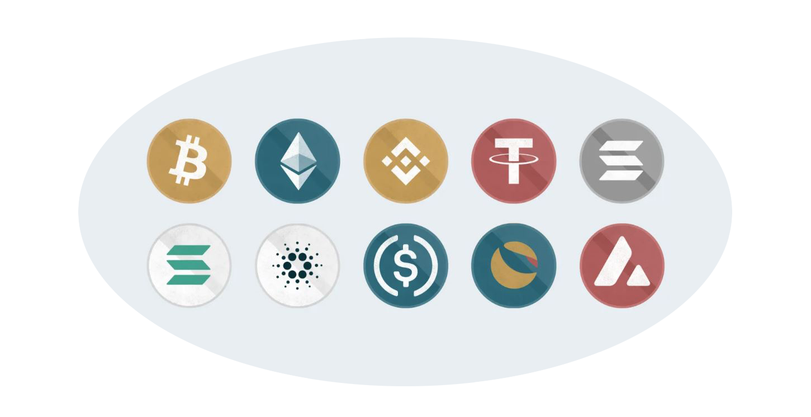

<div align="center">
    <h1>CryptoNotifs</h1>
    <a href="https://www.instagram.com/crypto.notifs/">
    
    </a>
</div>

## Concept
The idea behind this project was to create a cryptocoin tracker that will be publicly accesible and easy to use.
I chose to use Instagram for this because of the huge user base and simple UI.
<br><a href="https://www.instagram.com/crypto.notifs/">Here</a> is an instagram profile where the app is implemented.

## How it works
The app consists of 3 modules, CoinGecko API, Instagram API and local database.
I chose to use <a href="https://www.coingecko.com/en/api">CoinGecko API</a> because it's free to use with very generous plan of 50 requests a minute.
There is also a neat <a href="https://github.com/man-c/pycoingecko">Python wrapper</a> so I used that.
To communicate with Instagram I went with superb <a href="https://github.com/adw0rd/instagrapi">Instagrapi</a>
where I made my own client wrapper for saving login sessions
and using my own client settings like user-agent and did little tweaks to their methods I was using.
Local relational database is used for storing information of all crypto coins and their respective prices
along with the users/comments from the Instagram. The communication with database is established through <a href="https://www.sqlalchemy.org/">SQLAlchemy</a>. 

## Usage
To use the tracker simply add a comment under the first (pinned) post in profile.
Your comment has to follow the formatting as follows: <br>

   ```
   [cryptocoin_symbol][condition(</>)][target_value][currency (optional)]
   ```

_Cryptocoin **names/symbols** are in a description of the post.<br>
**Condition** is a simple sign higher/lower than (</>). <br>
**Target value** is pretty self-explanatory. <br>
**Currency** is optional and default is USD._

## Examples
### To get notified when: <br>
_Bitcoin is under 20 000$_
   ```sh
   btc<20000
   ```
_Ethereum reached 2 000€_
   ```sh
   eth>2000eur
   ```

## Contact
If you wish to contact me for whatever reason you can do so on discord.<br>
_odTbo#8053_

## License
_TBD_